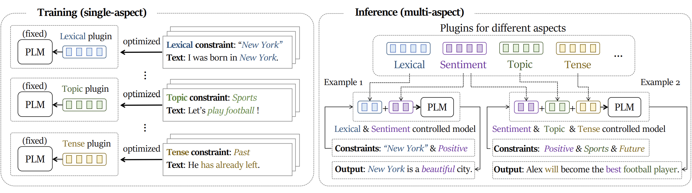
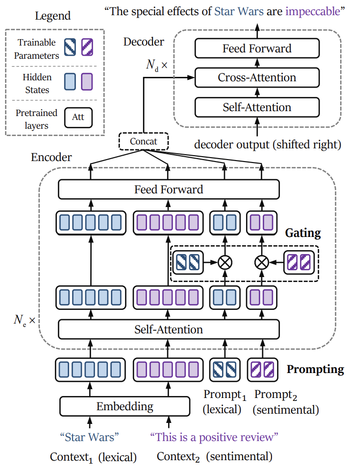

# PromptGating4MCTG

This is the repo for our work “[An Extensible Plug-and-Play Method for Multi-Aspect Controllable Text Generation](https://arxiv.org/abs/2212.09387v2)” (ACL 2023).

Our work focuses on **Multi-Aspect Controllable Text Generation (MCTG)** that controls the generated text in multiple aspects (e.g., sentiment, topic, and keywords). Our approach, **Prompt Gating**, is based on parameter efficient tuning methods (e.g., prefix-tuning), which control aspects by inserting trainable prompts or prefixes into the model, referred to as plugins. Specifically, Prompt Gating achieves higher fulfillment of constraints while maintaining the efficiency of training and inference. Each plugin for a single aspect is trained individually and is trained only once. Multi-aspect controlling is realized by synthesizing multiple plugins without training. Please refer to our [paper](https://arxiv.org/abs/2212.09387v2) for more details.

## Contents

* [Examples](#examples)
* [Method](#method)
* [Requirements](#requirements)
* [Data Preparation](#data-preparation)
* [Training](#training)
* [Evaluation](#evaluation)
* [Checkpoints](#checkpoints)
* [Citation](#citation)


## Examples
**Text Generation**
| Topic | Sentiment | Generated Text          |
| ------------- | ----------- |----------- |
| Mexican     | Positive     | While this is happening i’m going here for dinner for the first time. the food here was very, very good and very tasty!! we ordered a couple of different salads and some tacos. i got a vego beef taco with a spicy sauce (it is very good). i also got an onion rings (it does not have any onions, nor are there many onions in this recipe), and it was delicious!|
| Asian     | Positive     | Once upon a time i was at the restaurant and had dinner at a friend’s place, the food was great. the chef is very knowledgeable (the owner’s daughter is a sushi professional), but i can only say that the restaurant was very clean and the food was very flavor. |
| Asian | Negative      |While this is happening, i’ve never been here to the japanese section and have never eaten here before. the place is small and the place is crowded. the food is small, and the service isn’t very friendly. i did not expect to spend a lot of money for a sushi place because it’s pretty small. they have a few places where they can take a large order and they give it to those who pay for the food. also the staff seems to ignore you if you come for sushi.|

**Machine Translation**
| Keywords | Tense | Knowledge (French) | Source (German) | Generated Translation |
| ------------- | ----------- |----------- |  ----------- |----------- |
| "This", "bedroom", "completely"| Past | Cette chambre et une autre ont été complètement brûlées. | Dieses und ein weiteres Zimmer brannten vollständig aus. | This and another bedroom burned completely out.|
| "attempt" | Future | Demain, il tentera de s’entraîner avec l’équipe. | Morgen wird er versuchen, mit der Mannschaft zu trainieren. | Tomorrow he will attempt to train with the team.|

## Method

**Overview of our method**:


Each plugin for a single aspect is trained individually and is trained only once. The combination of multiple aspects of constraints is realized by concatenating multiple plugins without training (i.e., in a zero-shot manner).

**Model structure**:

<a href="url"></a>

It shows the case of inference stage of double-aspect controlled text generation. Blue and purple represent lexical and sentimental constraints respectively. Continuous prompts and contextual contexts are fed into the model and  trainable gates are applied to steer the pretrained model as well as alleviate the mutual interference of plugins.


## Requirements

Two different virtual environments are required for training and evaluation.

### Training

```bash
pip install -r requirements_training.txt
```

### Evaluation

```bash
pip install -r requirements_eval.txt
```

## Data Preparation

### Yelp for Text Generation

1. Prepare [Yelp](http://tts.speech.cs.cmu.edu/style_models/yelp_reviews.txt) dataset following the guidance on [this repo](https://github.com/facebookresearch/MultipleAttributeTextRewriting/tree/main/data#1-fyelp).

2. Detokenize the raw text and discard the samples with a sentiment score of 3 (neutral).

3. Sample 30k/3k samples for training and validation respectively, and for positive/negative sentiment, Asian/USA/Mexican food respectively. (Remember the other attributes are balanced in each training/validation set.)  
To identify the tense of each review sentence, we use [this repo](https://github.com/ajitrajasekharan/simple_tense_detector). We modified some of the code which is presented in `codes/exp_tense/tense_detector_t.py`.  
To extract keywords from each review sentence, we use this command.

    ```bash
    cat /path/to/yelp/sent_valid.txt | python codes/thumt_gen/scripts/sample_mask.py > /path/to/processed/yelp/mask_sent_valid.txt
    ```

4. Save these samples into `/path/to/processed/yelp`. The training/validation set of Each attribute has two files with text and manual constraints in each line.

    ```txt
    # pos_sent_valid.txt
    ...
    super friendly, courteous, and excellent service. serg and the other young woman who works here are great and checked up on us
    ...

    # pos_label_valid.txt
    ...
    This is a positive review.
    ...
    ```

5. Perform sentencepiece tokenization on the text files and save the tokenized files into `/path/to/processed/yelp`. The script is in `codes/spm_gen.sh`.

    ```txt
    # pos_sent_valid.spm.txt
    ...
    super Ġfriendly , Ġcour te ous , Ġand Ġexcellent Ġservice . Ġser g Ġand Ġthe Ġother Ġyoung Ġwoman Ġwho Ġworks Ġhere Ġare Ġgreat Ġand Ġchecked Ġup Ġon Ġus
    ...

    # pos_label_valid.spm.txt
    ...
    This Ġis Ġa Ġpositive Ġreview .
    ...
    ```

Now, the files in `/path/to/processed/yelp` should be like this:

```txt
├── pos_label_train.spm.txt
├── pos_label_valid.spm.txt
├── pos_sent_train.spm.txt
├── pos_sent_valid.spm.txt
└── neg/usa/mexi/asian/mask(keywords)/future/past/present......
```

### WMT14 DE-EN for Machine Translation

1. Prepare WMT14 DE-EN dataset in parallel format in `/path/to/processed/wmt`.

    ```txt
    /path/to/processed/wmt
    ├── train.de
    └── train.en
    ```

2. Extract keywords constraints from target sentences using the command below:

    ```bash
    cat /path/to/processed/wmt/train.en | python codes/thumt/scripts/sample_mask.py > /path/to/processed/wmt/train.en.masked.num.s
    ```

    Label the tense of each source sentence using [this repo](https://github.com/ajitrajasekharan/simple_tense_detector) as well.

    Translate target sentences to French use any MT model you like. We uses `codes/translate_en_fr/summon_dummy.sh`.

    Repeat the same operation with validation and test set (newstest2013 and newstest2014).

3. Perform sentencepiece tokenization on the text files and save the tokenized files into `/path/to/processed/wmt`. The script is in `codes/spm.sh`.

Now, the files in `/path/to/processed/wmt` should be like this:

```txt
├── train.spm.en
├── train.spm.fr
├── train.spm.de
└── ......
```

## Training

### Text Generation

1. Download vocabulary file of BART model into `/path/to/pretrain_BART`. If the file is in json format, then convert it with `codes/pretrain_BART/process_vocab.py`. And also prepare `config.json` and `pytorch_model.bin` in `/path/to/pretrain_BART`.

2. Choose one script of `exp_train_generation_*.sh` and run it.

### Machine Translation

1. Download vocabulary file of mBART model and other files in the [google drive](https://drive.google.com/drive/folders/1wqmM6eR1AG66ano-zbCzYykWoaQvYTJO?usp=sharing) into `/path/to/pretrain_mBART`.

2. Choose one script of `exp_train_*.sh` and run it.

After training, you can transfer the prompts and gates of each model into one model and evaluate it. Some example script is `codes/thumt/scripts/substitute_prompt_gating.py`, `codes/thumt_gen/scripts/substitute_prompt_gating.py`

## Evaluation

After merging different prompts and gates, you can evaluate the model on different tasks.

### Text Generation

1. Process the manual constraints for test set in `/path/to/processed/yelp/infer`, each of the file contains 375 lines of constraint sentences. For example, `neg_label.375.spm.txt` contains 375 lines of `This is a negative review.` and is tokenized.

    Tokenized prefixes used in the paper are in `data/infer_gen/pre_tokens.25.spm.txt`. Positive key words and negative key words for inference are ramdomly sampled and tokenized in `data/infer_gen/maskfix.pos.375.spm.txt` and `data/infer_gen/maskfix.neg.375.spm.txt`. You still nees to install [this repo](https://github.com/ajitrajasekharan/simple_tense_detector) to evaluate the tense attribute.

2. Train a classifier on sentiment and food category. The script is in `codes/train_classifier/train_*.py`. Follow the paper to oversample the raw data and train the classifiers.

3. Run `codes/infer_train_generation_yelp.sh` and remember to change the `src_attached` and `prompt_attached` symultaneously according to the combination of prompts and gates you want to evaluate.

### Machine Translation

1. Run `codes/infer_train_translation.sh` and remember to change the `src_attached` and `prompt_attached` symultaneously according to the combination of prompts and gates you want to evaluate.

2. With the translated results, use `codes/exp_tense/calc_tense_acc.py` to evaluate the accuracy of tense attribute.

## Checkpoints

Remember to check how many prompts and gates are in the checkpoint and merge them into one model if necessary.

### Text Generation

The checkpoints with prompts and gates of different attributes are in [google drive](https://drive.google.com/drive/folders/1Tg7kZX4h01rb44ld6z65yFaWTUMGDZbn?usp=sharing).

### Machine Translation

The checkpoints with prompts and gates are in [google drive](https://drive.google.com/drive/folders/1O_hyjwIsV6fNYifvbcgFBYp0HUGGRrPs?usp=sharing).

## Citation

If you find this repo helpful, please cite the following:

```bibtex
@inproceedings{huang2023extensible,
  title={An Extensible Plug-and-Play Method for Multi-Aspect Controllable Text Generation},
  author={Xuancheng Huang, Zijun Liu, Peng Li, Tao Li, Maosong Sun, Yang Liu},
  booktitle={Proceedings of the 61st Annual Meeting of the Association for Computational Linguistics},
  publisher={Association for Computational Linguistics},
  year={2023}
}
```
